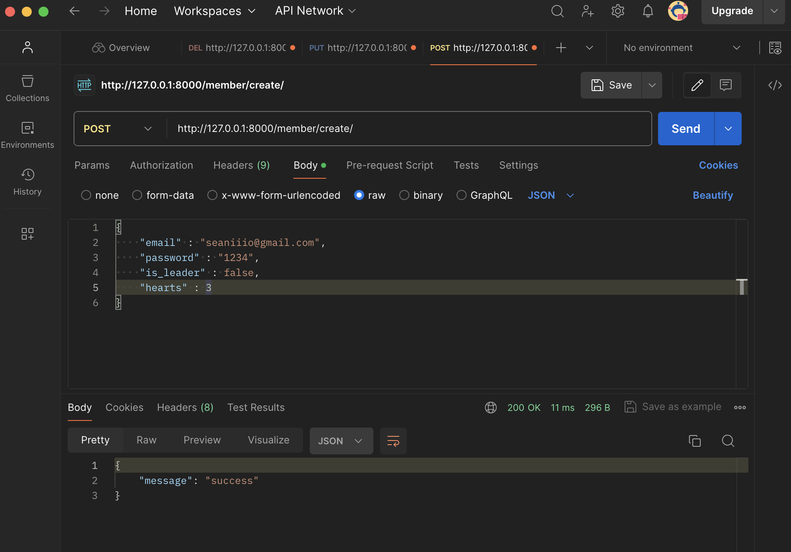
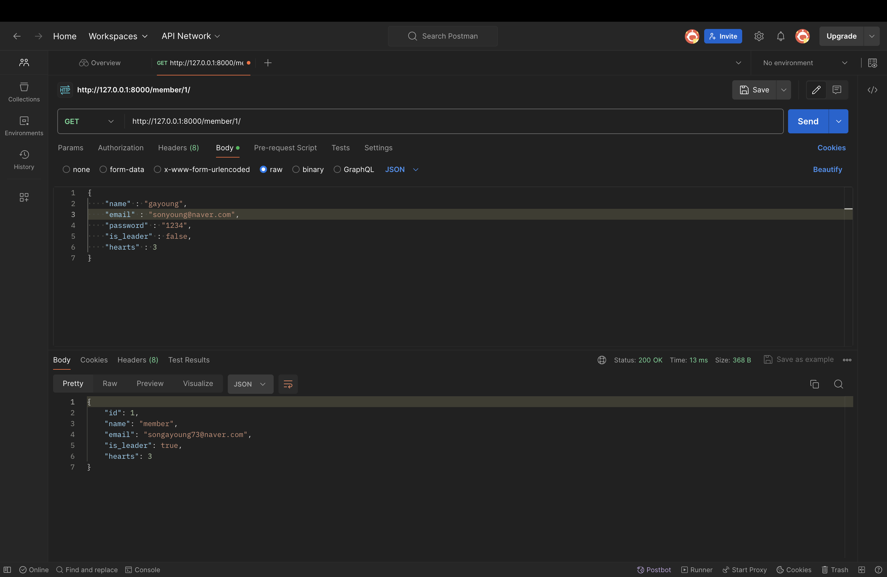
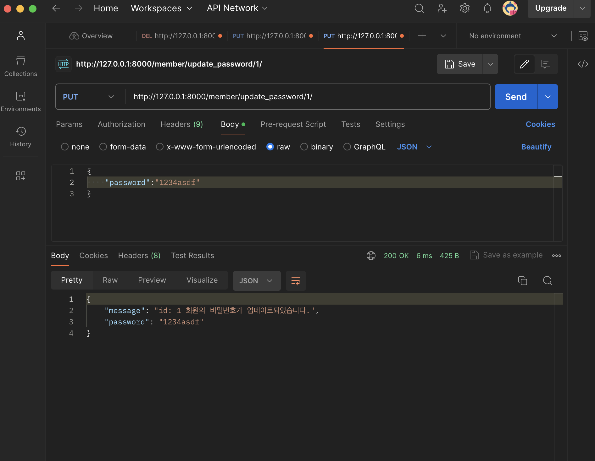
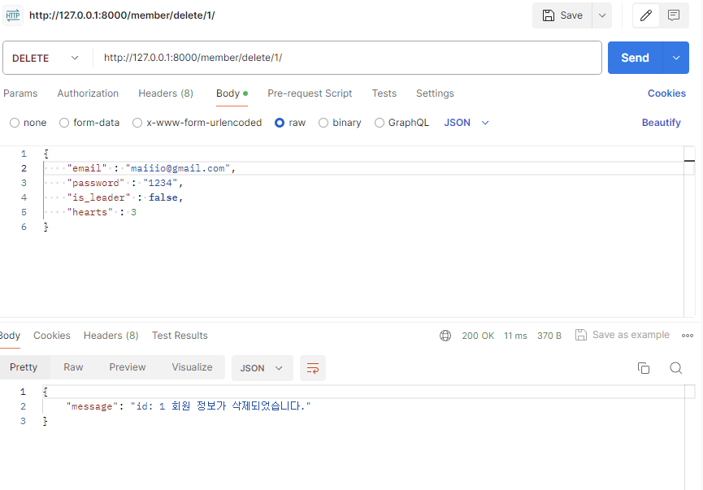
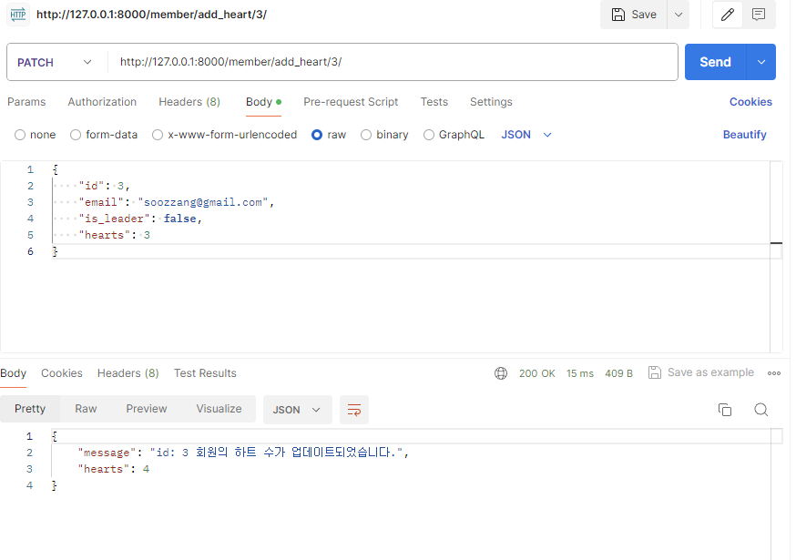
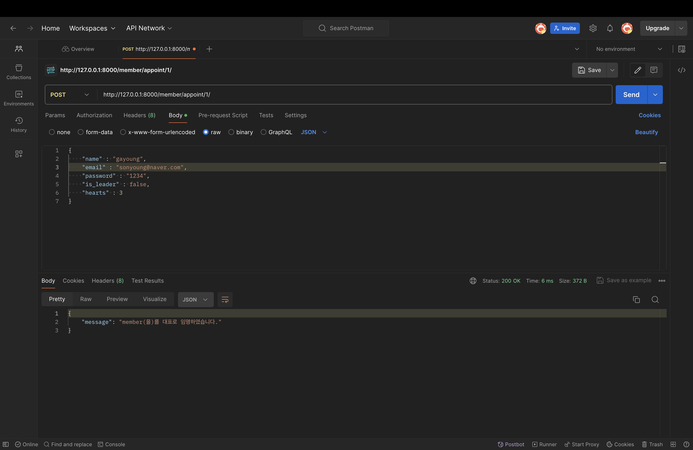
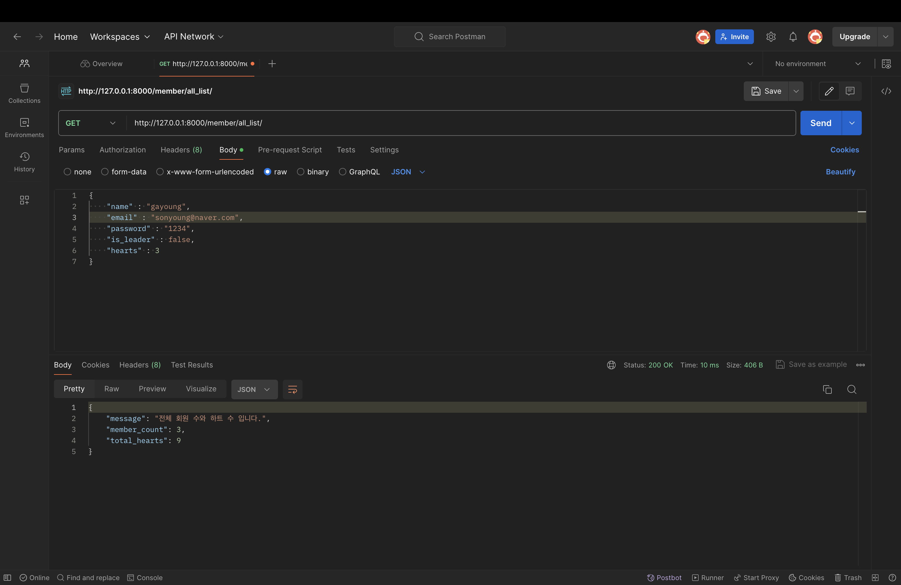

# 장고 심화세션 4팀 과제 레포

### 1. 회원 생성 - 김시원

### 2. 회원 정보 조회 - 김시원

### 3. 회원 정보 수정 - 김시원

### 4. 회원 정보 삭제 - 최우진

### 5. 하트 누르기 - 최우진

### 6. 대표로 임명하기, 대표 자격 박탈시키기 -손가영

### 7. 모든 회원들의 정보조회 - 손가영

